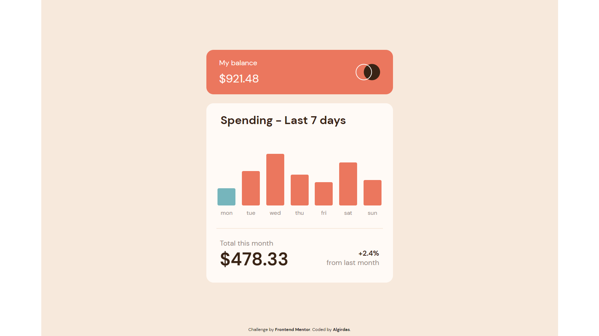

# Frontend Mentor - Expenses chart component solution

## Table of contents

- [Overview](#overview)
  - [The challenge](#the-challenge)
  - [Screenshot](#screenshot)
  - [Links](#links)
- [My process](#my-process)
  - [Built with](#built-with)
  - [What I learned](#what-i-learned)
- [Author](#author)

## Overview

### The challenge

Users should be able to:

- View the bar chart and hover over the individual bars to see the correct amounts for each day
- See the current day’s bar highlighted in a different colour to the other bars
- View the optimal layout for the content depending on their device’s screen size. Min width is 330px
- See hover states for all interactive elements on the page
- **Bonus**: Use the JSON data file provided to dynamically size the bars on the chart

### Screenshot

- Live Site URL: (https://legendary-kangaroo-7386ac.netlify.app/)

## My process

### Built with

- Semantic HTML5 markup
- CSS custom properties
- SCSS
- Flexbox
- BEM
- JS

### What I learned

I learned how to use forEach(element, index) method and two parameters at the same time and how to animate the bar charts to have them start from zero, also highlight current day's bar automatically.

To see how you can add code snippets, see below:

### Useful resources

## Author

- Website - [Algirdas](https://github.com/AlgirdasU/IP-address-tracker-master)
- Frontend Mentor - [@Algirdase](https://github.com/AlgirdasU/Expenses-chart-component-main)
- Twitter - [@AlgirdasDdd](https://twitter.com/algirdasddd)

